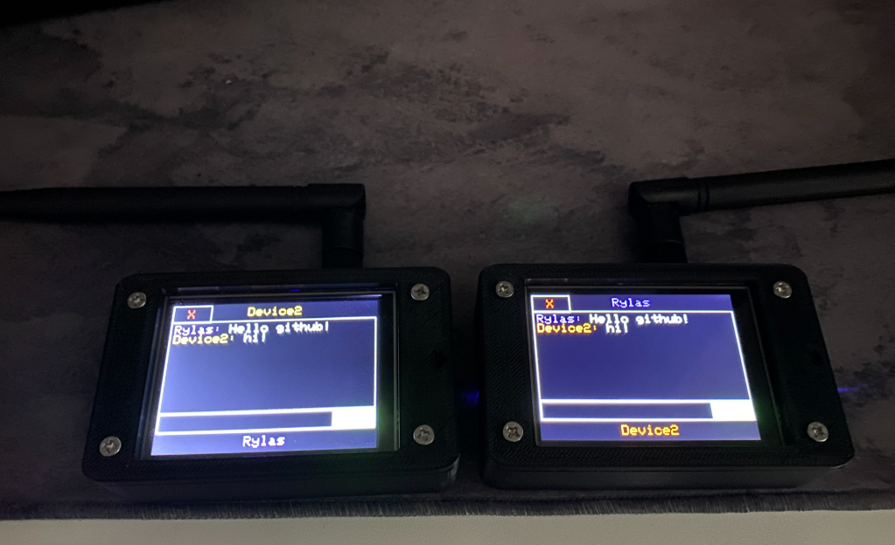
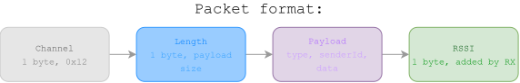
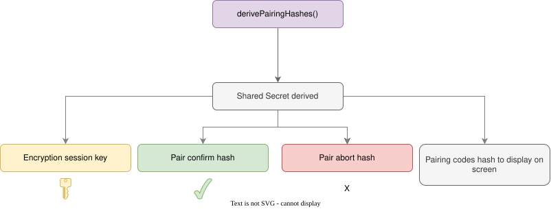
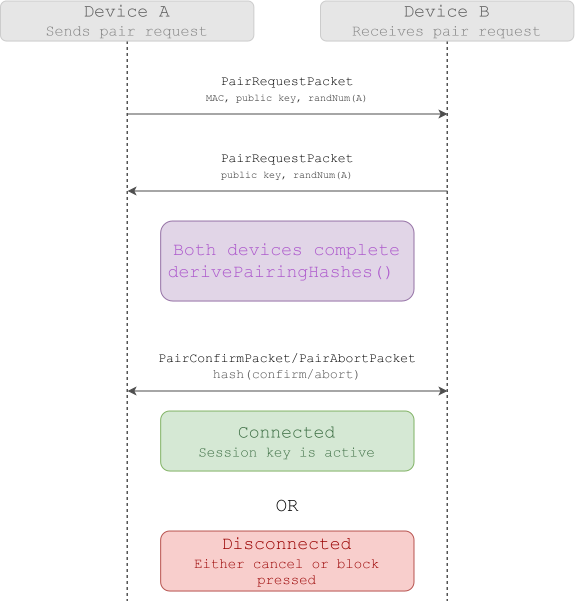
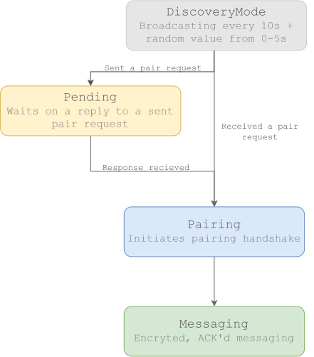
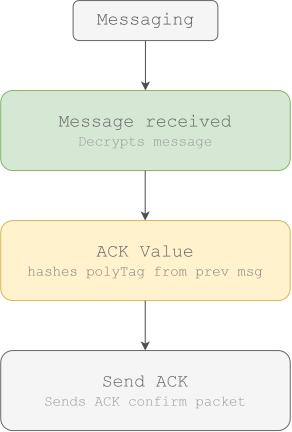

# ESPEncrypt

## Summary
An end-to-end encrypted communication device using the ESP32. Utilises an X25519 key exchange + ChaCha20-Poly1305 for authenticated encryption, complete with a full touchscreen UI and ACK logic.

Uses either a LoRa UART module (highly recommended for useable distance) or the built in 2.4GHz capabilities of the ESP32.

### Hardware required:
**WiFi edition:**
- ESP32 CYD (ESP32-2432S028R)

**LoRa edition:**
- ESP32 CYD (ESP32-2432S028R) 
- DX-LR32 UART Transceiver (other UART Transceivers might work as long as AT settings are changed in the .ino file).

**Extra for LoRa battery use:**
- 3D STL file provided in [add later]
- Battery no bigger than 50mm x 34mm x 9mm
- a "Type-C USB 5V 2A Boost Converter Step-Up Power Module"

Refer to images folder for reference of parts and assembly.

### Installation guide
WiFi edition: Download and upload through Arduino IDE.

LoRa edition: Download the .ino file and upload after you ensure that AT settings match your local laws, default uses 868MHz at 2148 bit/s.

## How it works
### First boot
The device uses Diffie-Hellman key exchange on first boot to generate its own private and public keys to store in flash. The ESP32 uses its antenna to pick up electrical noise for hardware randomness. This is used in the key generation as well as all times when randomness is required in order to derive an unpredictable and unique set of keys for each device.

### Discovery stage
After first boot is completed we enter discovery mode. In this stage every device broadcasts on the frequency band chosen (868MHz default), source MAC, length of the packet, username, public key and finally an RSSI Byte. This is done every 10s + 0-5s. The 0-5s addition is to counter the half-duplexing constraint of the LoRa module which will later be explained further. (LoRa edition)

### Pairing
If a device has been found, we can choose to click on it to pair. If clicked we send, a PairRequestPacket and enter the pending mode whilst waiting for a response. Receiving devices ALWAYS return a PairRequestPacket back. 
PairRequestPackets contain the device's username, public key and a 16 byte random number chosen and a few other details such as if we are already paired or not.

When each device has both its own PairRequestPacket data and the peer's PairRequestPacket, it will then run derivePairingHashes(). This function first uses X25519 to create a shared secret based on the other user's public key and the current device's private key. Then the function sorts both the received random number and transmitted random number in chronological order for later use. 

The function then uses the shared secret, ordered random numbers and a different string for each of the next hashes:

- Pairing Codes Hash (Displays pin codes on first pair for user comparison) (Only calculated if device isn't already paired)
- Pair Confirm Hash (Sent when a user presses pair, encrypted so that spoofers cannot send false requests)
- Pair Abort Hash (Likewise needs to be protected from spoofers)
- Session Key (Used for message encrypting if pair is successful)
  

Both devices now would have come to the same exact hashes. The pairing codes hash is now displayed on screen as a 6 digit number and asks the user to compare to see if the codes match (NOTE: This only happens on the first ever pair). If pair is pressed, a packet with the confirm hash is sent to the other device. Once both devices send their pair hash, a comparison is made. If they match, they enter pair mode.

If cancel or block is pressed, the device sends the pair abort hash alongside type cancel or type block. These are to notify the user of any actions taken by the other device.

If the device is reconnecting rather than pairing, next to the username of the peer a green circle will appear where previously the circle was grey. The block option is also removed as they have verified themselves as not spam. The options instead will be reconnect or cancel with no pairing codes in sight. This is because the first comparison is complete and has confirmed the other device as trust worthy.Both paired and blocked devices are saved in flash so that they are stored between reboots. 

This concludes the discovery stage and pairing stage

### Messaging
All messages sent or received now use the session key derived previously to encrypt and decrypt messages through ChaChaPoly, a combination of ChaCha20 and Poly1305. All messages require a 12 byte nonce (random number used once) to encrypt. This is calculated using esp_random() once again, but is then sent out publicly in the packet alongside the encrypted message. This is because we aren't relying on the random number to do any heavy lifting, instead that is done by the session key which actually is the important value to keep a secret. The only reason it is used is because ChaChaPoly requires a new value so that repeat messages do not leak information about the session key. 

ChaCha20 is responsible for encryption, Poly1305 gives us a reference to confirm if the message has been decrypted without tampering. This is a polyTag and is sent alongside the encrypted message. When decrypting the incoming message, we can ask Poly1305 to compare the tag received with our decrypted text. If it doesn't match, we discard the message. However, the polyTag has a second purpose. That second purpose is to work as the ACK tag.

### ACK/retrying
When messaging peer-to-peer, we risk messages being lost. Waiting for a response once a message has been received can confirm that this is not the case. That's exactly what ACK does. When sending a message, we keep reference of the sent message's polyTag and make a hash of it. We now wait a while to receive the same hash back so we know they have just received the most recent outgoing message. If we don't receive this ACK message back, we re send the packet a certain amount of times (5 by default) before calling it quits. This ensures that all messages are confirmed to be received before sending the next message. The code re-sends the text packet every 3s + 0-4s (random) if a message hasn't been received.

### Half-duplexing

This topic has previously been brought up and means that we cannot transmit and receive at the same time. We have already discussed handling packet collision during discovery mode and messaging mode. A similar process is done for the pairing buttons / PairRequestPacket. By ensuring we use multiple sends and adding a random jitter, we make the chances of missing multiple consecutive messages extremely unlikely, making packets reach their destination reliably (confirmed through testing).

## Libraries used

- Crypto by rweather
- TFT_eSPI by Bodmer
- XPT2046_Touchscreen by Paul Stoffregen

The project wouldn't work without the maintainers of these libraries. Many thanks to them all.
